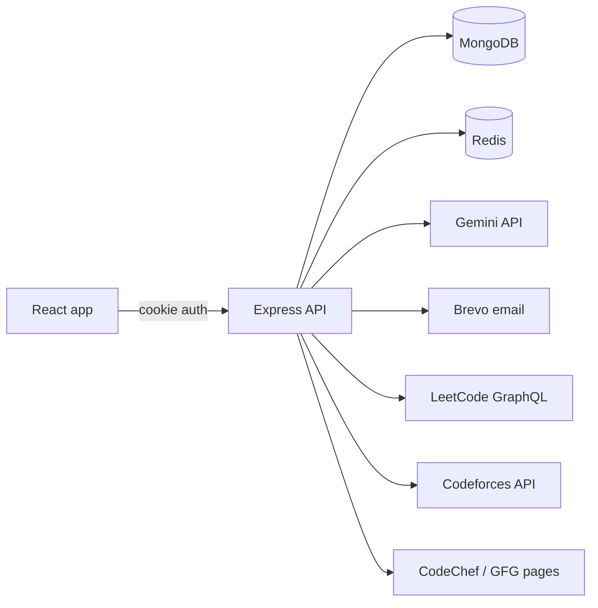

# COD TRAKR

> One dashboard for your competitive-programming journey: track stats across **LeetCode, Codeforces, CodeChef and GeeksforGeeks**, keep personal notes on problems (with your mistakes), and get personalised advice from an **AI coach** that helps to boost your skills in competitive-programming.

**Frontend:** https://codtrakr.nitishojha.in  ·  **API:** https://cod-trakr-sor4.onrender.com

---

## Features

- **Email-OTP signup & cookie-based login**: passwords hashed with bcrypt, JWT stored in an `httpOnly` cookie, signup data held in Redis until the OTP is verified.
- **Unified dashboard**: link your usernames once; the app aggregates total problems solved, contests, best rating and platform count.
- **Problem notes**: save problems with tags, a 0-3 star importance rating, a description, your solution notes and the *mistakes to avoid*. Filter by tag or stars, view a "top priority" list, paginated 8 per page.
- **AI Coach**: a Gemini-powered chat that knows your coding stats; conversation history is persisted and can be cleared.
- **Redis caching**: platform stats cached per username, notes lists cached per user and invalidated on every write.

## Tech stack

| Layer | Technology |
|---|---|
| Frontend | React 18, React Router 6, Axios, marked (markdown rendering), plain CSS (dark/light via CSS variables) |
| Backend | Node.js, Express 5 |
| Database | MongoDB with Mongoose 9 |
| Cache / rate-limit | Redis (node-redis v5) |
| Auth | JWT in `httpOnly` + `Secure` + `SameSite=None` cookie, bcryptjs |
| Email | Brevo transactional email API |
| AI | Google Gemini (`gemini-2.5-flash`) via `@google/generative-ai` |

## Architecture



**Dashboard request flow (platform-level caching)**

```
GET /api/dashboard/dashboard
  → load user's saved usernames from MongoDB
  → for each platform (in parallel):
        Redis hit?  → use it
        miss        → fetch from the platform → store in Redis (24 h)
  → aggregate totals → respond
```

See the flow diagrams in [`Backend/controllers/authFlow.md`](Backend/controllers/authFlow.md) and the `Backend/utils/*Flow.md` files.

## Project structure

```
COD_TRAKR/
├── Backend/
│   ├── index.js                  # app bootstrap: CORS, routes, DB + Redis connect
│   ├── config/                   # db.js, redis.js, axiosConfig.js
│   ├── middlewares/auth.js       # JWT cookie verification (+ token blocklist check)
│   ├── routes/                   # authRoute, dashRoute, notesRoutes, chatRoute
│   ├── controllers/              # authController, dashboardController, noteController, chatController
│   ├── models/                   # User, Note, Chat
│   └── utils/                    # leetcode, codeforces, codechef, gfg, sendEmail, generateOTP, validator
├── frontend_react/               # current React client (Create React App)
│   └── src/ (api.js, App.jsx, components/Layout.jsx, pages/*, styles/global.css)
└── frontend_plain/               # legacy plain HTML/JS client (superseded by frontend_react)
```

## Getting started

### Prerequisites

- Node.js 18+
- A MongoDB database (local or Atlas)
- A Redis instance (local or cloud)
- API keys: [Brevo](https://www.brevo.com/) (email) and [Google AI Studio](https://aistudio.google.com/) (Gemini)

### 1. Backend

```bash
cd Backend
npm install
```

Create `Backend/.env`:

```env
PORT=4000
MONGO_URI=mongodb+srv://<user>:<pass>@<cluster>/<db>
JWT_KEY=<long random string>
NODE_ENV=production

REDIS_USER_NAME=default
REDIS_USER_PASS=<redis password>
REDIS_USER_HOST=<redis host>
REDIS_USER_PORT=<redis port>

BREVO_API_KEY=<brevo api key>
GEMINI_API_KEY=<gemini api key>
```

```bash
npm run dev     # nodemon
# or
npm start
```

The API listens on `http://127.0.0.1:4000`.


### 2. Frontend

```bash
cd frontend_react
npm install
npm start       # http://localhost:3000
```

The API base URL is defined in `frontend_react/src/api.js`. Point it at `http://127.0.0.1:4000` for local development.


## API reference

All routes are prefixed with the API base URL. Routes marked 🔒 require the `token` cookie and return `401 {"message":"Unauthorized"}` otherwise. Send requests with `withCredentials: true`.

### Auth

| Method | Endpoint | Auth | Description |
|---|---|---|---|
| POST | `/api/auth/signup-generate-otp` | - | Validate input, rate-limit, email an OTP, return a `signupId` |
| POST | `/api/auth/signup-verify-otp` | - | Verify OTP, create the user, set the auth cookie |
| POST | `/api/auth/login` | - | Verify credentials, set the auth cookie |
| POST | `/logout` | - | Clear the auth cookie |

**`POST /api/auth/signup-generate-otp`**

```json
// request
{ "name": "Rahul Kumar", "email": "rahul@example.com", "password": "Str0ng!Pass" }

// 200
{ "message": "OTP sent", "signupId": "b1d2…-uuid" }
```

- Password rules: 8-128 chars, at least 1 lowercase, 1 uppercase, 1 number, 1 symbol, no spaces.
- Rate limit: **4 OTP requests per email per 3 hours** (`429` after that).
- The pending signup (with hashed password and hashed OTP) lives in Redis for **5 minutes**.

**`POST /api/auth/signup-verify-otp`**

```json
// request
{ "signupId": "b1d2…-uuid", "otp": "1234" }

// 200 (sets cookie `token`, valid 1 hour)
"Signup successful"
```

**`POST /api/auth/login`**

```json
// request
{ "email": "rahul@example.com", "password": "Str0ng!Pass" }

// 200 (sets cookie `token`, valid 1 hour)
"Login successful"
```

### Dashboard

| Method | Endpoint | Auth | Description |
|---|---|---|---|
| GET | `/api/dashboard/me` | 🔒 | Current user profile (without password) |
| POST | `/api/dashboard/accounts` | 🔒 | Save platform usernames |
| GET | `/api/dashboard/dashboard` | 🔒 | Live (cached) stats aggregated across platforms |

**`POST /api/dashboard/accounts`**

```json
{
  "platforms": {
    "LeetCode":   { "username": "your_lc_handle" },
    "Codeforces": { "username": "your_cf_handle" },
    "CodeChef":   { "username": "your_cc_handle" },
    "GFG":        { "username": "your_gfg_handle" }
  }
}
```

**`GET /api/dashboard/dashboard`** → `200`

```json
{
  "platforms": {
    "LeetCode": { "username": "…", "solved": 320, "rating": 1650, "rank": 120345, "contests": 18 },
    "Codeforces": { "username": "…", "solved": 210, "rating": 1320, "rank": "pupil" }
  },
  "totalSolved": 530,
  "totalContests": 18,
  "bestRating": 1650,
  "platformCount": 2
}
```

### Notes (problem tracker)

| Method | Endpoint | Auth | Description |
|---|---|---|---|
| POST | `/api/notes/new` | 🔒 | Create a problem note |
| GET | `/api/notes/problem?page=1` | 🔒 | All notes, ordered by `problemId` |
| GET | `/api/notes/problemByImportance?page=1` | 🔒 | All notes, highest stars first |
| GET | `/api/notes/problemById/:problemId` | 🔒 | One note with all fields |
| PUT | `/api/notes/problem/:problemId` | 🔒 | Update a note |
| DELETE | `/api/notes/problem/:problemId` | 🔒 | Delete a note |
| GET | `/api/notes/tag/:tag?page=1` | 🔒 | Notes containing a tag |
| GET | `/api/notes/stars/:stars?page=1` | 🔒 | Notes with an exact star rating (0-3) |

**`POST /api/notes/new`**

```json
{
  "problemName": "Two Sum",
  "problemLink": "https://leetcode.com/problems/two-sum/",
  "problemDescription": "Find two indices that add up to target",
  "tags": ["array", "hashmap"],
  "stars": 3,
  "notes": "Store value→index in a map while iterating.",
  "mistake": "Forgot that the same element can't be used twice."
}
```

`201` → `{ "success": true, "data": { …note } }`

**List endpoints** return (8 items per page):

```json
{
  "success": true,
  "page": 1,
  "totalProblems": 23,
  "totalPages": 3,
  "count": 8,
  "data": [
    { "problemId": 1, "problemName": "two sum", "tags": ["array"], "problemLink": "…", "stars": 3 }
  ]
}
```

**Constraints**

| Field | Rule |
|---|---|
| `problemName` | required, 3-100 chars, stored lowercase, unique per user |
| `problemDescription` / `problemLink` | max 200 chars |
| `stars` | 0, 1, 2 or 3 |
| `tags` | max 10 |
| `mistake` | max 500 chars |
| `notes` | max 1000 chars |
| Per user | maximum **50** problems; `problemId` is assigned automatically (per-user counter) |

**Error codes:** `400` validation, `404` not found, `409` duplicate / limit reached.

### AI Coach

| Method | Endpoint | Auth | Description |
|---|---|---|---|
| GET | `/api/chat/history` | 🔒 | Load the saved conversation |
| POST | `/api/chat/send` | 🔒 | Send a message, receive the AI reply |
| DELETE | `/api/chat/clear` | 🔒 | Delete the conversation |

**`POST /api/chat/send`**

```json
// request
{ "message": "Give me a 30-day plan to reach 1600 rating" }

// 200
{ "reply": "markdown text…", "history": [ { "role": "user", "parts": [{ "text": "…" }] }, … ] }
```

The conversation is trimmed to the **last 50 messages**. Replies are markdown.

## Caching & limits at a glance

| What | Redis key | TTL |
|---|---|---|
| LeetCode / Codeforces / CodeChef / GFG stats | `leetcode:<username>` · `codeforces:<username>` · `codechef:<username>` · `gfg:<username>` | 24 h |
| Notes lists | `notes:all:<userId>:<page>` · `notes:importance:…` · `notes:tag:…` · `notes:stars:…` | 24 h (cleared on every create/update/delete) |
| Single note | `note:<userId>:<problemId>` | 24 h |
| Pending signup | `signup:<signupId>` | 5 min |
| OTP request counter | `otp_limit:<email>` | 3 h |

## Roadmap

- [ ] Limit OTP verification attempts and move to 6-digit codes
- [ ] Forgot-password / change-password flow
- [ ] Background refresh of platform stats instead of scraping inside the request
- [ ] Automated tests and CI
- [ ] Rating-history charts and daily-streak tracking

## Author

**Nitish Ojha**: [@Nitishojha00](https://github.com/Nitishojha00)